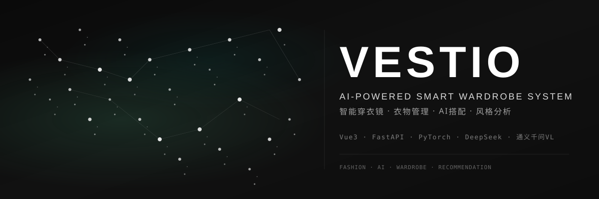

<div align="center">



<br>

### 🪞 后端工程师的第一个全栈 AI 产品

[](https://github.com/dirjaker/vestio/stargazers)
[](https://github.com/dirjaker/vestio/network/members)
[](https://github.com/dirjaker/vestio/graphs/contributors)
[](https://github.com/dirjaker/vestio/blob/main/LICENSE)
[](https://vuejs.org/)
[](https://fastapi.tiangolo.com/)

</div>

---

## ✨ 功能特性

| 功能 | 描述 |
|------|------|
| 👗 **衣橱管理** | 上传、分类、搜索衣物，支持批量导入和标签管理 |
| ✂️ **AI 抠图** | 一键去除衣物背景，自动裁剪为标准化图片 |
| 🎨 **风格分析** | 基于通义千问 VL 识别衣物风格、颜色、材质 |
| 🤖 **智能搭配** | AI 根据天气、场合、风格自动推荐穿搭方案 |
| 🌤️ **天气推荐** | 接入实时天气数据，推荐适合当前天气的穿搭 |
| 🎭 **AI 插画** | 将真人穿搭照转换为动漫风格插画 |

## 📸 系统预览

<div align="center">

> 🖼️ 请在此处放置系统截图或 GIF 演示

</div>

## 🚀 快速开始

### 环境要求

- Python 3.12+
- Node.js 18+
- Conda（推荐）

### 安装步骤

```bash
# 1. 克隆项目
git clone https://github.com/dirjaker/vestio.git
cd vestio

# 2. 创建并激活虚拟环境
conda create -n vestio python=3.12 -y
conda activate vestio

# 3. 安装后端依赖
pip install -r requirements.txt

# 4. 安装前端依赖
cd frontend && npm install && cd ..

# 5. 配置环境变量
cp .env.example .env
# 编辑 .env，填入 API Key

# 6. 启动服务
python main.py
```

### 访问地址

| 服务 | 地址 |
|------|------|
| 🌐 前端页面 | http://localhost:5173 |
| 📡 API 文档 | http://localhost:8000/docs |
| 📊 管理后台 | http://localhost:8000/admin |

## 🏗️ 技术架构

```
┌─────────────────────────────────────────────────────┐
│                    前端 (Vue 3)                      │
│  ┌──────────┐ ┌──────────┐ ┌──────────┐ ┌────────┐  │
│  │ 衣橱管理 │ │ 穿搭推荐 │ │ 风格分析 │ │ AI插画 │  │
│  └──────────┘ └──────────┘ └──────────┘ └────────┘  │
└───────────────────────┬─────────────────────────────┘
                        │ HTTP API
┌───────────────────────┴─────────────────────────────┐
│                  后端 (FastAPI)                      │
│  ┌──────────┐ ┌──────────┐ ┌──────────┐ ┌────────┐  │
│  │ 用户认证 │ │ 衣物管理 │ │ AI 服务  │ │ 天气API│  │
│  └──────────┘ └──────────┘ └──────────┘ └────────┘  │
│                                                     │
│  ┌──────────┐ ┌──────────┐ ┌──────────────────────┐ │
│  │ SQLite   │ │ 图片存储 │ │ 通义千问 VL / DeepSeek│ │
│  └──────────┘ └──────────┘ └──────────────────────┘ │
└─────────────────────────────────────────────────────┘
```

## 📁 项目结构

```
vestio/
├── frontend/           # Vue 3 + Naive UI 前端
│   ├── src/
│   │   ├── views/      # 页面组件
│   │   ├── components/ # 通用组件
│   │   ├── stores/     # Pinia 状态管理
│   │   └── api/        # API 接口封装
│   └── public/
├── src/                # FastAPI 后端
│   ├── routers/        # 路由
│   ├── models/         # 数据模型
│   ├── services/       # 业务逻辑
│   └── utils/          # 工具函数
├── uploads/            # 上传文件存储
├── .env.example        # 环境变量模板
├── main.py             # 启动入口
└── requirements.txt    # Python 依赖
```

## 🛠️ 技术栈

| 层级 | 技术 |
|------|------|
| **前端** | Vue 3、Naive UI、Pinia、Vite |
| **后端** | FastAPI、SQLAlchemy、Pydantic |
| **数据库** | SQLite |
| **AI 模型** | 通义千问 VL（图片分类）、DeepSeek（文本推理） |
| **抠图** | rembg（本地推理，无需 API） |
| **部署** | Uvicorn、Nginx |

## 📝 开发日志

- [x] 衣橱管理 CRUD
- [x] AI 抠图（rembg）
- [x] 通义千问 VL 图片分类
- [x] 天气 API 接入
- [x] 智能搭配推荐
- [x] AI 插画生成
- [ ] 移动端适配
- [ ] 社区分享功能

## 📄 许可证

[MIT License](LICENSE)

---

<div align="center">

🔗 **GitHub**: [dirjaker/vestio](https://github.com/dirjaker/vestio)

⭐ 如果这个项目对你有帮助，请给一个 Star 支持一下！

</div>
